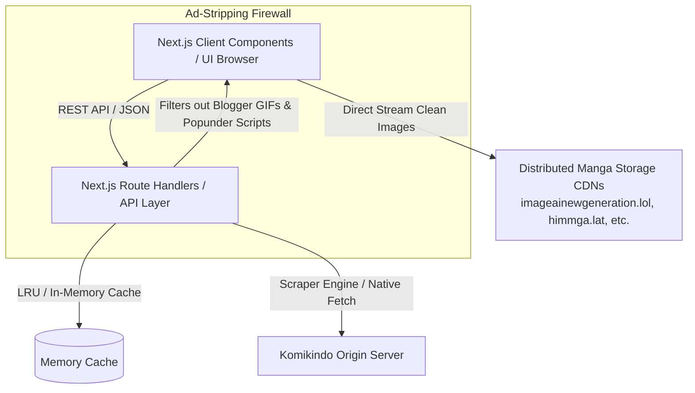
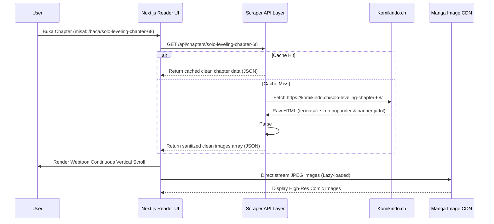

# 🏗️ Architecture & Technical Design: Komikindo Clean Reader

## 1. High-Level System Architecture



Aplikasi dibangun menggunakan model **Headless Reader Architecture**:
1. **Frontend Layer (Next.js App Router + Tailwind CSS):**
   * Bertanggung jawab menyajikan antarmuka yang modern, responsif, berkecepatan tinggi, dan 100% steril dari script iklan.
2. **Backend / API Route Layer (`/app/api/...`):**
   * Mengambil data HTML dari Komikindo via HTTP client server-side.
   * Melakukan sanitasi HTML, regex parsing, dan ekstraksi data terstruktur.
   * Menyediakan in-memory caching untuk mengurangi latensi dan beban scraping.
3. **Direct Asset Streaming:**
   * URL gambar komik yang telah bersih dikirimkan ke browser untuk di-render langsung dari CDN gambar tanpa hambatan CORS atau pembatasan hotlink.

---

## 2. Component Architecture & Data Flow



---

## 3. Data Models & TypeScript Types

```typescript
export interface ComicCard {
  title: string;
  slug: string;
  thumbnail: string;
  type: 'Manga' | 'Manhwa' | 'Manhua' | 'Unknown';
  isColor: boolean;
  latestChapter: {
    slug: string;
    title: string;
    updated: string;
  } | null;
}

export interface Genre {
  slug: string;
  name: string;
}

export interface ChapterItem {
  slug: string;
  title: string;
  date: string;
}

export interface ComicDetail {
  title: string;
  slug: string;
  thumbnail: string;
  metadata: Record<string, string>;
  synopsis: string;
  genres: Genre[];
  totalChapters: number;
  chapters: ChapterItem[];
}

export interface ChapterData {
  chapterSlug: string;
  comicSlug: string | null;
  prevChapter: string | null;
  nextChapter: string | null;
  totalImages: number;
  images: string[];
}

export interface Bookmark {
  slug: string;
  title: string;
  thumbnail: string;
  lastReadChapterSlug?: string;
  lastReadChapterTitle?: string;
  lastReadAt: number;
  addedAt: number;
}
```

---

## 4. Security & Ad-Stripping Invariants
1. **No External Script Execution:** Aplikasi web kustom tidak memuat skrip pihak ketiga apa pun (`windowylarvule.com`, `ileacringes.com`, Google Tag Manager asing, dsb.).
2. **Domain Whitelist Filter:** URL gambar yang diterima hanya diizinkan jika berasal dari domain ekstensi data gambar komik yang sah (`/data/`, format `.jpg`, `.jpeg`, `.webp`, `.png`) dan secara eksplisit memblokir domain banner iklan (`blogger.googleusercontent.com`, `.gif`, dsb.).
3. **Client-Side Privacy:** Seluruh riwayat bacaan dan bookmark disimpan murni pada `localStorage` pengguna. Tidak ada data pribadi yang dikirim ke server pihak ketiga.
